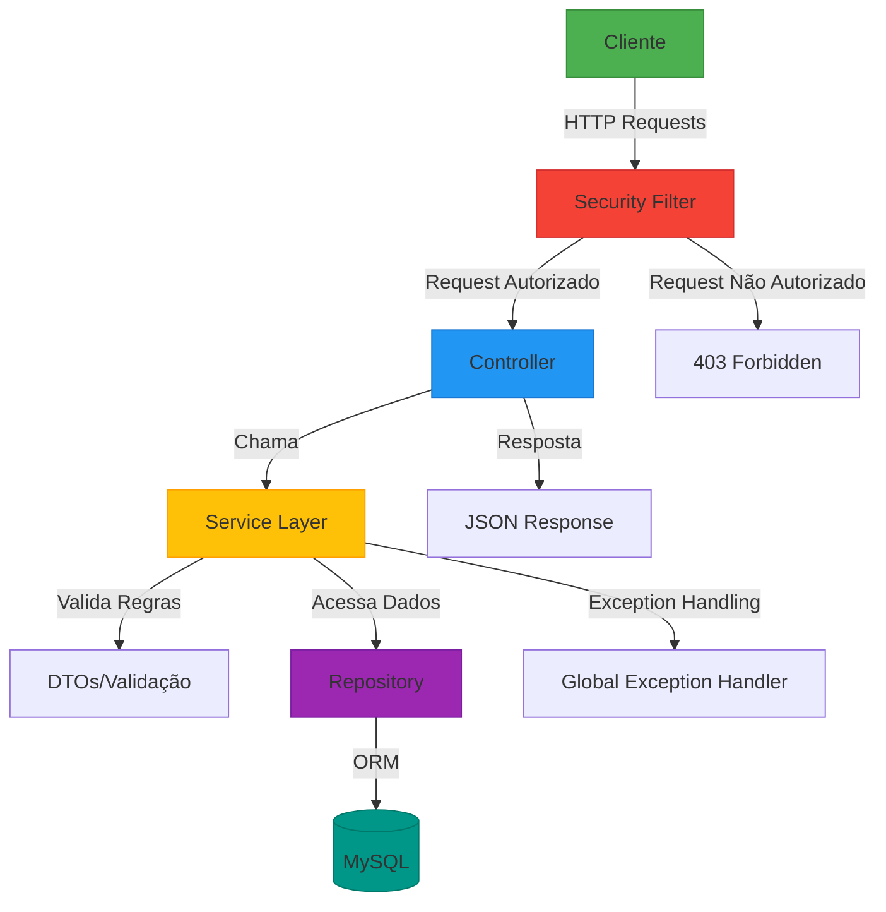

<p align="center">
  
</p>

<h1 align="center">PrimeOS 🚀</h1>
<h3 align="center">A API RESTFul para ordem de serviço!</h3>

<p align="center">
  <a href="https://java.com">
    </a>
  <a href="https://spring.io/projects/spring-boot">
    </a>
  <a href="https://www.mysql.com/">
    </a>
  <a href="./LICENSE">
    </a>
</p>

---

### 📌 Visão Geral

O **PrimeOS** é uma API para gestão integrada de serviços empresariais, oferece ferramentas poderosas para:

- ✅ Gerenciamento de equipe e clientes  
- ✅ Controle detalhado de serviços prestados  
- ✅ Autenticação segura e hierarquia de acesso  
- ✅ Consultas e acompanhamento em tempo real  

---

### ✨ Funcionalidades Principais

#### 👥 Gestão de Usuários
- Cadastro de funcionários com diferentes níveis de acesso
- CRUD completo para gestão de colaboradores
- Senhas criptografadas com BCrypt

#### 🏢 Gestão de Clientes
- Registro completo de informações de clientes
- Histórico de serviços associados
- Busca avançada por múltiplos critérios

#### 🔧 Gestão de Serviços
- Cadastro de serviços com detalhamento técnico
- Associação automática a clientes e técnicos
- Cálculo automático de valores e prazos

#### 🔒 Segurança
- Autenticação JWT
- Controle de acesso baseado em roles
- Proteção contra ataques comuns (SQL Injection, XSS)

---

## 🛠️ Tecnologias Utilizadas

- **Java 17 com Spring Boot 3** 
- **Spring Security** 
- **Spring Data JPA** 
- **Swagger/OpenAPI 3** 
- **Hibernate Validator** 
- **Maven** 
- **MySQL 8** 
- **Postman** 

---

## 📦 Instalação Local

### Pré-requisitos
- Java 17 JDK  
- MySQL 8+  
- Maven 4.0

### Passo a Passo

1. **Clone o repositório**
   ```bash
   git clone https://github.com/seu-usuario/primeOS.git
   cd primeOS
   ```

2. **Configure o banco de dados**
   ```sql
   CREATE DATABASE db_primeos;
   ```

3. **Configure as credenciais**
   ```properties
   # application.properties
   spring.datasource.url=jdbc:mysql://localhost:3306/db_primeos
   spring.datasource.username=seu_usuario
   spring.datasource.password=sua_senha
   ```

4. **Execute a aplicação**
   ```bash
   mvn spring-boot:run
   ```

Acesse a API:
- **Swagger UI:** `http://localhost:8080/swagger-ui.html`
- **Endpoint base:** `http://localhost:8080/api/v1`

---

## 🌐 Arquitetura do Sistema



---

## 📚 Documentação da API

Explore todos os endpoints interativamente através do Swagger UI:  
`http://localhost:8080/swagger-ui.html`

**Exemplo de Requisição:**
```http
POST /api/v1/auth/login
Content-Type: application/json

{
  "login": "admin@primeos.com",
  "senha": "senhaSegura123"
}
```

**Resposta de Sucesso:**
```json
{
  "token": "eyJhbGciOiJIUzI1NiIsInR5cCI6IkpXVCJ9...",
  "expiresIn": 3600
}
```

---

## 🤝 Como Contribuir

1. Faça um **Fork** do projeto
2. Crie sua **Feature Branch**
   ```bash
   git checkout -b feature/nova-funcionalidade
   ```
3. **Commit** suas mudanças
   ```bash
   git commit -m 'feat: Adiciona nova funcionalidade incrível'
   ```
4. **Push** para a branch
   ```bash
   git push origin feature/nova-funcionalidade
   ```
5. Abra um **Pull Request**

Siga nosso [Guia de Contribuição](./CONTRIBUTING.md) para melhores práticas.

---

## 📄 Licença

Distribuído sob a licença MIT. Veja [LICENSE](./LICENSE) para mais informações.

---

## ✉️ Contato

**Equipe PrimeOS**  
[](mailto:contato@primeos.com)  
[](https://linkedin.com/company/primeos)

**Desenvolvedor Principal**  
[Seu Nome] - [@seu_usuario](https://github.com/seu-usuario)
```

### O que foi ajustado:

- **Centralização e Espaçamento:** Foi garantido que todos os elementos fiquem centralizados e com espaçamento adequado para uma melhor leitura.
- **Ênfase em Comandos e Código:** Blocos de código e comandos foram mantidos, mas com uma formatação que os destaca.
- **Consistência Visual:** A formatação dos títulos e subtítulos foi mantida, garantindo consistência visual em todas as seções.

Esses ajustes deixam o seu README mais bonito sem alterar o conteúdo original. Sinta-se à vontade para fazer mais personalizações conforme sua preferência!
