<p align="center">
  
</p>

<h3 align="center">PrimeOS 🚀</h3>
<h3 align="center">API RESTful para ordem de serviço!</h3>
<h5 align="center">(Expansões futuramente!)</h5>
<p align="center">
  <a href="https://java.com">
    </a>
  <a href="https://spring.io/projects/spring-boot">
    </a>
  <a href="https://spring.io/projects/spring-security">
    </a>
  <a href="https://spring.io/projects/spring-data-jpa">
    </a>
  <a href="https://swagger.io/">
    </a>
  <a href="https://maven.apache.org/">
    </a>
  <a href="https://www.mysql.com/">
    </a>
</p>

---

<br>

<h2>📌 Visão Geral</h2>

**PrimeOS** é uma API RESTful desenvolvida como uma solução empresarial que oferece funcionalidades robustas para o gerenciamento de usuários, clientes e serviços, além de implementar recursos de segurança avançados, como autenticação JWT e criptografia de senhas, garantindo um ambiente confiável para o controle e monitoramento de ordens de serviço em tempo real.

🔎 Quer saber mais sobre os **detalhes do projeto, endPoints e data base**?  
Acesse o documento completo [aqui!](https://economic-jaborosa-ec9.notion.site/API-RESTful-PRIME-OS-1a8268a7953a80249eb9d47cbac28916?pvs=4)

<br>

<h2>✅ Principais Funcionalidades</h2>

#### 👥 Gestão de Funcionários
- Cadastro de funcionários com diferentes níveis de acesso
- CRUD completo para gestão de colaboradores
- Senhas criptografadas com BCrypt

#### 🏢 Gestão de Clientes
- Registro completo de informações de clientes
- Histórico de serviços associados
- Busca avançada por diferentes critérios

#### 🔧 Gestão de Serviços
- Cadastro de serviços com detalhamento técnico
- Associação a clientes e técnicos
- Consulta de serviços existentes
 
  <br>

<h2 align="center">🛠️ Tecnologias Utilizadas 🛠️</h2>

<br>

<p align="center">
  
  
  
  
  
  
  
  
</p>
<br>


<h2 align="center">🌐 Arquitetura do Sistema 🌐</h2>


<br>

```mermaid
graph TD
    A[Usuário] -->|HTTP Requests| B[Security Filter]
    B -->|Request Autorizado| C[Controller]
    C -->|Chama| D[Service Layer]
    D -->|Valida Regras| E[DTOs/Validação]
    D -->|Acessa Dados| F[Repository]
    F -->|ORM| G[(MySQL)]
    D -->|Exception Handling| H[Global Exception Handler]
    C -->|Resposta| I[JSON Response]
    B -->|Request Não Autorizado| J[403 Forbidden]
    
    style A fill:#4CAF50,stroke:#388E3C
    style B fill:#F44336,stroke:#D32F2F
    style C fill:#2196F3,stroke:#1976D2
    style D fill:#FFC107,stroke:#FFA000
    style F fill:#9C27B0,stroke:#7B1FA2
    style G fill:#009688,stroke:#00796B
```

## 📚 Documentação da API

Explore todos os endpoints interativamente através do Swagger UI:  
`http://localhost:8080/swagger-ui.html`

**Exemplo de Requisição:**
```http
POST /auth/login
Content-Type: application/json

{
  "login": "admim",
  "senha": "admin"
}
```

**Resposta de Sucesso:**
```json
{
  "token": "eyJhbGciOiJIUzI1NiIsInR5cCI6IkpXVCJ9...",
}
```
<br>

## 📦 Faça a Instalação Local

### Pré-requisitos
- Java 17 JDK  
- MySQL 8+  
- Maven 4.0

### Passo a Passo

1. **Clone o repositório**
   ```bash
   git clone https://github.com/gustavopecanhaa/PrimeOS-APIRestFul.git
   cd PrimeOS-APIRestFul
   ```

2. **Configure o banco de dados**
   ```sql
   CREATE DATABASE db_primeos;
   ```

3. **Configure as credenciais**
   ```properties
   # application.properties
   spring.datasource.url=jdbc:mysql://localhost:3306/db_primeos
   spring.datasource.username=seu_usuario
   spring.datasource.password=sua_senha
   ```

4. **Execute a aplicação**
   ```bash
   mvn spring-boot:run
   ```

Acesse a API:
- **Swagger UI:** `http://localhost:8080/swagger-ui.html`
- **Endpoint base:** `http://localhost:8080/auth/login`

<br>

## 📄 Licença

Distribuído sob a licença MIT. Veja [LICENSE](./LICENSE) para mais informações.

<br>

## ✉️ Contato
**Fale com Gustavo Peçanha:** 

[](mailto:gustavopecanhaa@outlook.com)  [](https://www.linkedin.com/in/gustavopecanhaa/)

Feito com muito carinho =D!
